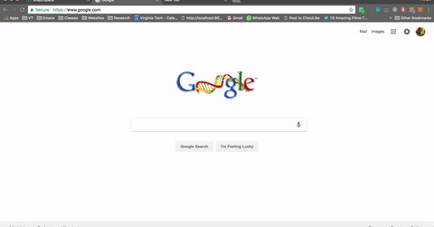

# bookstore-assistant
Chrome extension for University Bookstore at Virginia Tech - Course project for Usability Engineering

## How to install

- [Download](https://github.com/adbharadwaj/bookstore-assistant/archive/master.zip) the bookstore assistant extension.

- To install the extension, visit-  chrome://extensions in Chrome and drag the folder containing the above files into the window:

