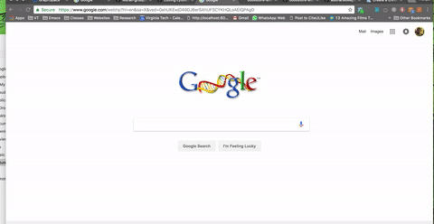

# bookstore-assistant
Chrome extension for University Bookstore at Virginia Tech - Course project for Usability Engineering

## How to install

- [Download](https://github.com/adbharadwaj/bookstore-assistant/archive/master.zip) the bookstore assistant extension.

- Unzip the downloaded folder.

- Visit-  chrome://extensions in Chrome and drag the folder into the window:

